# 📘 Principal Engineer Backend Handbook  
### *Complete Summary + All Mermaid Diagrams (A → K)*  
This `SUMMARY.md` is the **top-level table of contents** + **quick diagram reference** for all chapters.

---

# 🧭 Table of Contents

## **A — Java, Kotlin, JVM Internals**
- JVM structure  
- JIT, GC, Memory model  
- Kotlin coroutines vs threads  

## **B — Spring Boot Core Internals**
- Application startup  
- DispatcherServlet lifecycle  
- Auto-configuration  

## **C — Advanced Spring Boot Deep Dive**
- @Transactional internals  
- AOP proxying  
- JPA entity manager  
- Self-invocation issue  

## **D — Distributed Systems & Microservices**
- Sync/Async boundaries  
- Sagas & Orchestration  
- Event-driven communication  

## **E — Databases & Query Optimization**
- PostgreSQL MVCC  
- Query planner internals  
- Indexing strategies  
- Redis + LSM tree DBs  

## **F — DevOps, Cloud, Networking, K8s**
- Docker runtime stack  
- Kubernetes control plane  
- Networking fundamentals  

## **G — Observability & SRE**
- Logs, metrics, traces  
- SLOs & Error Budgets  

## **H — Security Engineering**
- OAuth2  
- JWT  
- Defense in Depth  

## **I — Performance Engineering**
- GC tuning  
- Backpressure  
- Threading vs async  
- Kernel + network tuning  

## **J — Architecture Design**
- Monolith vs microservices  
- CQRS + Event Sourcing  
- Data mesh  
- Scalability patterns  

## **K — Code Quality + Design Patterns**
- SOLID, DRY, YAGNI, KISS  
- DDD, Hexagonal, Clean Architecture  
- Anti-patterns + Refactoring  

---

# 🧩 Chapter-by-Chapter Mermaid Diagrams

---

# 🅰 Chapter A — JVM, Java, Kotlin

## JVM Architecture
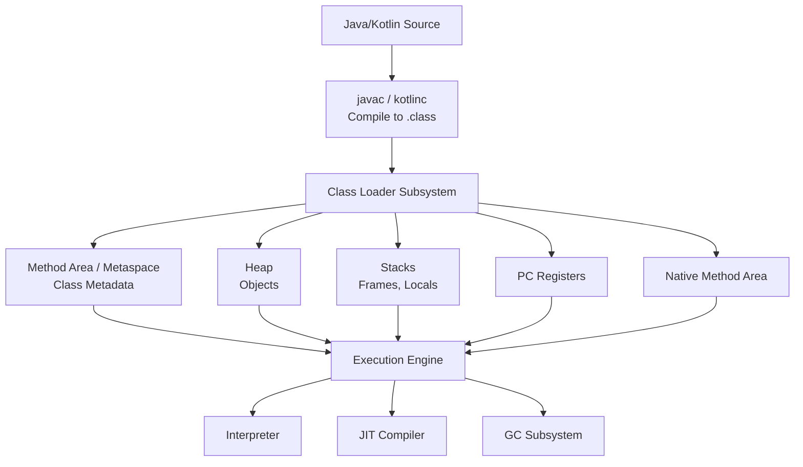

## Threads vs Coroutines
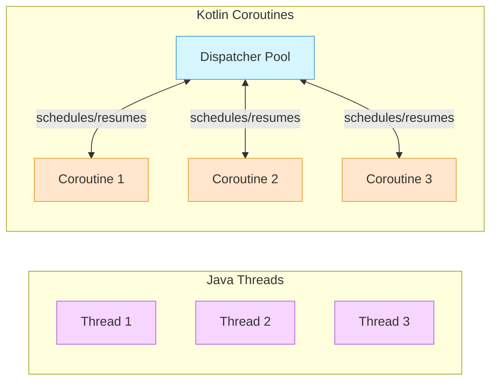

---

# 🅱 Chapter B — Spring Boot Core

## Spring Boot Startup
```mermaid
flowchart TD
    A[SpringApplication.run()] --> B[Prepare Environment]
    B --> C[Create ApplicationContext]
    C --> D[Load Bean Definitions]
    D --> E[Refresh Context]
    E --> F[Start Embedded Server]
```

## DispatcherServlet Lifecycle
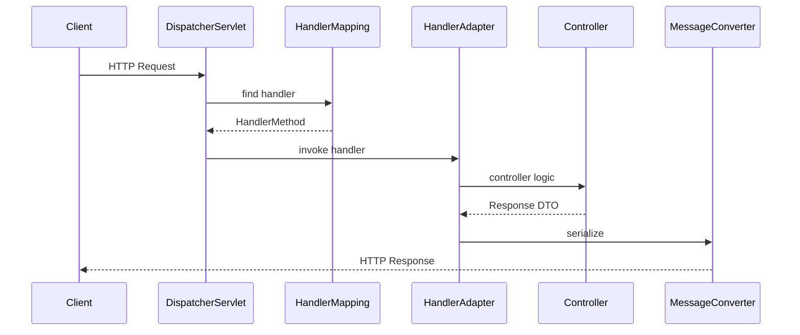

---

# 🅲 Chapter C — Advanced Spring (TX, AOP)

## Transaction Proxy Flow
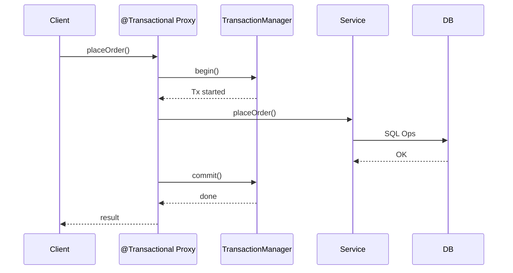

## Self Invocation Issue
```mermaid
flowchart LR
    A[Client] --> B[Transactional Proxy]
    B --> C[outer()]
    C --> D[inner()]:::nopxy

    classDef nopxy fill:#ffe6e6,stroke:#ff4d4f;
```

---

# 🅳 Chapter D — Distributed Systems

## Microservice Topology
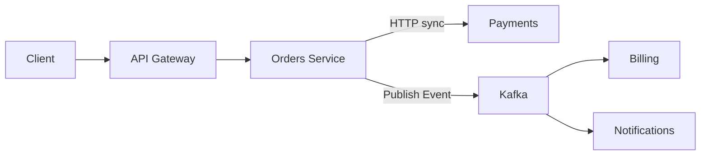

## Saga Orchestration
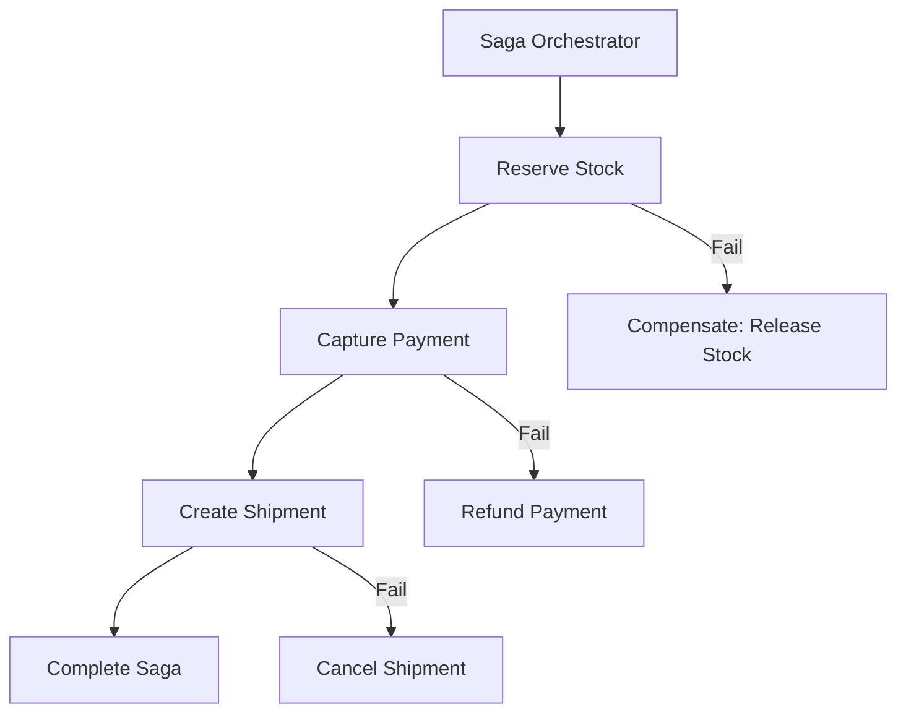

---

# 🅴 Chapter E — Databases

## PostgreSQL MVCC
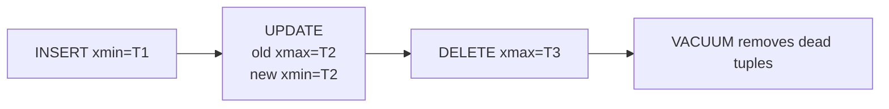

## Query Lifecycle
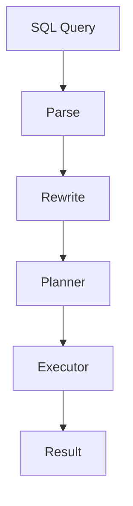

---

# 🅵 Chapter F — DevOps & K8s

## K8s Control Plane
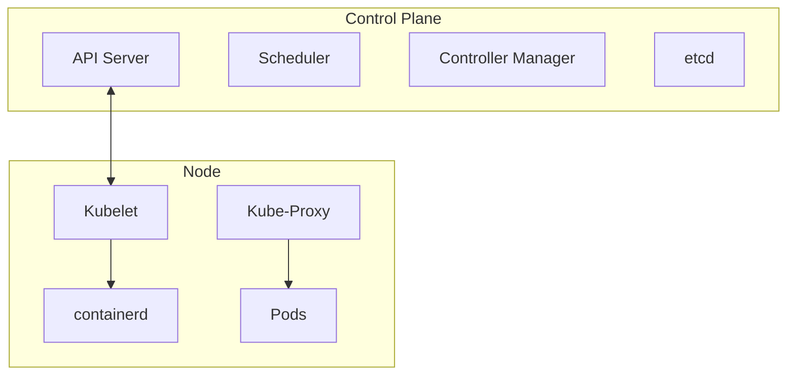

## Docker Stack
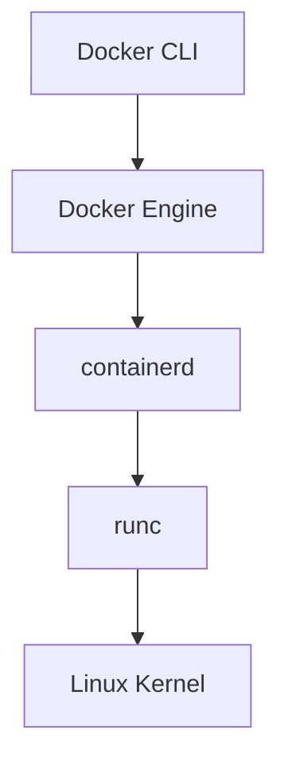

---

# 🅶 Chapter G — Observability & SRE

## Observability Pillars
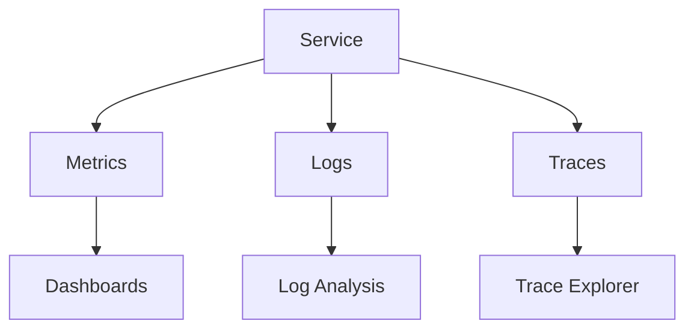

## Error Budget
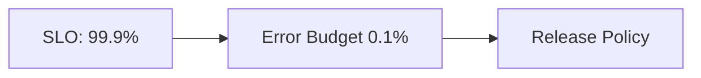

---

# 🅷 Chapter H — Security

## Defense in Depth
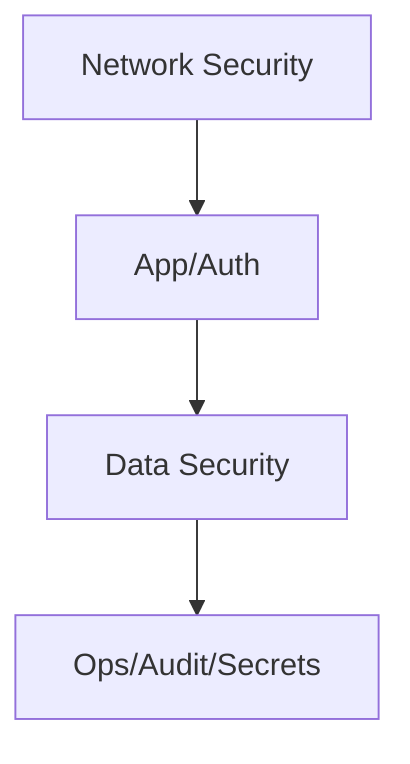

## OAuth2 / JWT
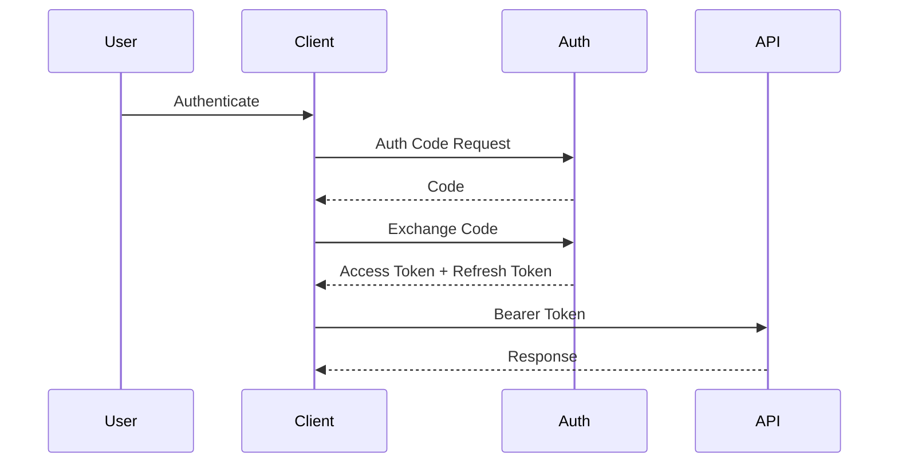

---

# 🅸 Chapter I — Performance

## Request Path
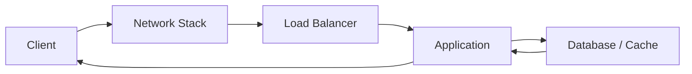

## Backpressure
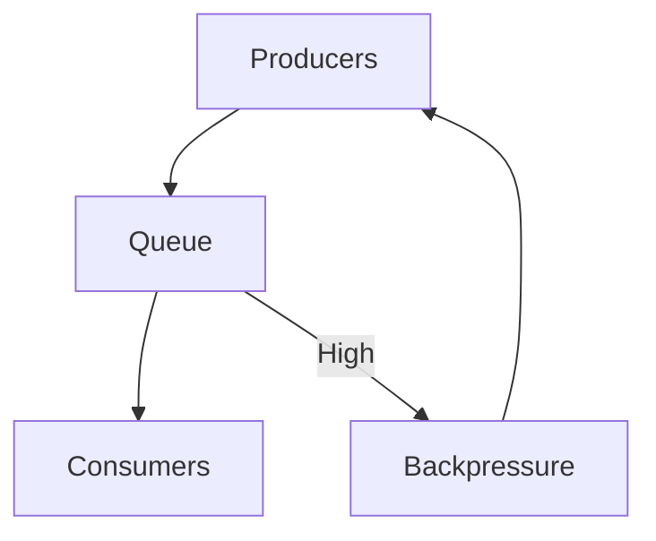

---

# 🅹 Chapter J — Architecture

## Monolith → Modular → Microservices
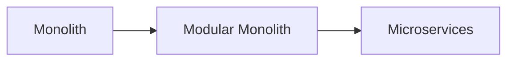

## CQRS Architecture
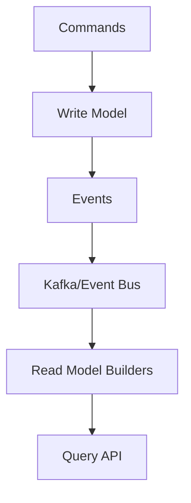

---

# 🅺 Chapter K — Design Patterns & Principles

## Hexagonal Architecture
```mermaid
flowchart TD
    subgraph Core[Domain & Use Cases]
      UC[Use Cases]
      DM[Domain Model]
    end

    subgraph Inbound[Inbound Adapters]
      REST[REST Controller]
      GRPC[gRPC Handler]
      KIN[Kafka Consumer]
    end

    subgraph Outbound[Outbound Adapters]
      DB[DB Repo]
      KOUT[Kafka Producer]
      EXT[External API]
    end

    REST --> UC
    GRPC --> UC
    KIN --> UC

    UC --> DB
    UC --> KOUT
    UC --> EXT
```

## Principle Map
```mermaid
flowchart TD
    SRP[SRP] --> Cohesion[High Cohesion]
    DIP[DIP] --> LowCoup[Low Coupling]
    DRY[DRY] --> ReduceDup
    KISS[KISS] --> Simplicity
    YAGNI[YAGNI] --> AvoidOverEng

    Cohesion --> Maintainable
    LowCoup --> Maintainable
    Simplicity --> Maintainable
```

---

# 📘 End of SUMMARY.md  
This file acts as the **top-level book index** + **universal diagram reference**.

