# 📚 Architecture Walkthrough of the Book (Chapters A → K)

High-level **knowledge architecture** of the entire handbook + a **mini concept-architecture** for each chapter.

---

## 0. Overall Book Flow (A → K)

```mermaid
flowchart LR
    A[ A: Java & Kotlin & JVM ] --> B[ B: Spring Boot Core ]
    B --> C[ C: Spring Advanced & Transactions ]
    C --> D[ D: Distributed Systems & Microservices ]
    D --> E[ E: Databases & Query Optimization ]
    E --> F[ F: DevOps, Cloud, K8s, Infra ]
    F --> G[ G: Observability & SRE ]
    G --> H[ H: Security Engineering ]
    H --> I[ I: Performance & High Throughput ]
    I --> J[ J: Architecture Design ]
    J --> K[ K: Design Principles & Code Quality ]
```

